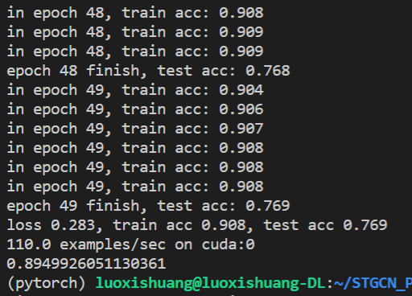

# STGCN_PyTorch

**仅中文(Chinese Only)**

这是基于PyTorch的一个STGCN实现，其中网络部分参考了[PaddleVideo](https://github.com/PaddlePaddle/PaddleVideo)的实现，并修改为PyTorch格式。

本项目仅是本人练手与熟悉STGCN的网络架构，出现bug请先排除环境问题，这个的issues大概率不会管。

以下提供了一个参考的已训练模型，其中精度如下图所示，使用预处理的NTU-RGB+D数据集进行训练，在xsub上进行训练与训练中测试，在xview的validate数据上进行模型评估，预训练数据也是由PaddleVideo提供。模型训练在单张3090Ti上耗时约5~6小时，最终模型训练精度0.90，测试精度0.76，评估精度0.89(***这一项不是很有参考意义，因为只是改变了原数据的分组方式而已***)。

下载模型：[百度网盘](https://pan.baidu.com/s/1zUEHWztYp6qAV3wG716Mmg?pwd=8rwl)||[Google Drive](https://drive.google.com/file/d/1kfE86WdirvwsuVfuBo3Lp8ak6ezvwyh-/view?usp=sharing)

模型使用：直接放在根目录下即可，名称为first_test.torchmodel，可以自行修改train.py与valid.py中保存与载入参数的路径来改变文件名。